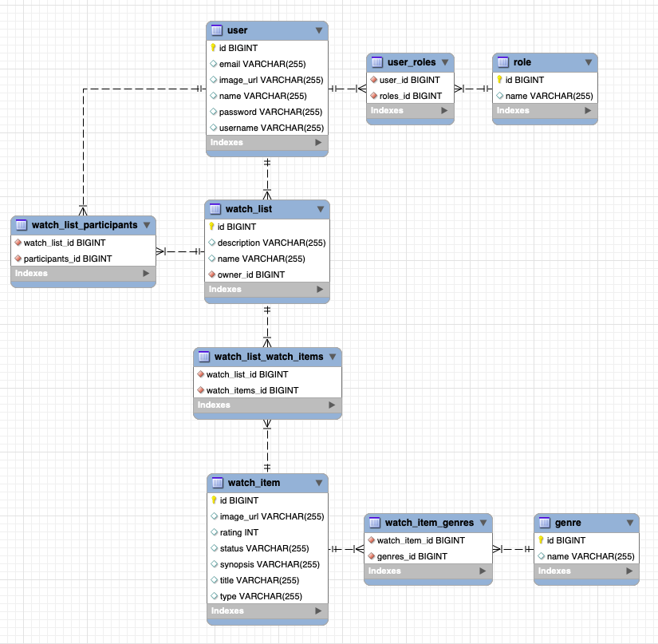

# What To Watch - REST API

A working REST API, built by [Beatriz Perez](https://github.com/beatriz-perez) using Spring Boot that runs on a server.

* Trello board: [join WTW trello board](https://trello.com/invite/b/6vu1AH4D/6b9ddcb9b22acd1688b9fc1ebf9efcc7/whattowatch-final-project)

## API documentation

DB tables:
