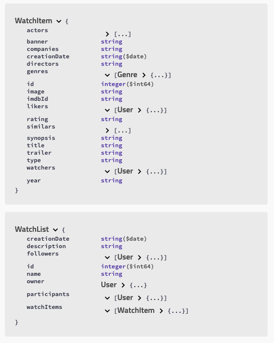
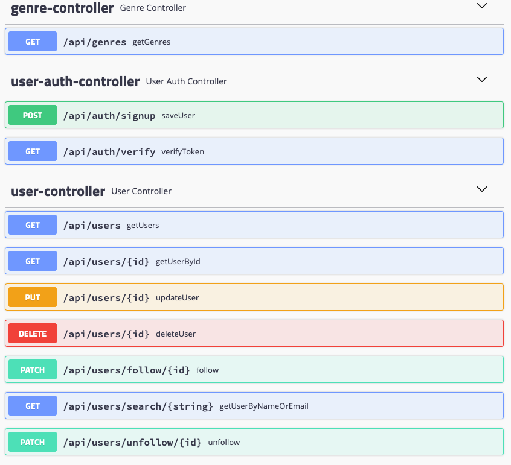

# What To Watch - REST API

A working REST API, built by [Beatriz Perez](https://github.com/beatriz-perez) using Spring Boot that runs on a server.

* Trello board: [join WTW trello board](https://trello.com/invite/b/6vu1AH4D/6b9ddcb9b22acd1688b9fc1ebf9efcc7/whattowatch-final-project)
* Swagger API documentation on: [swagger](http://localhost:5005/swagger-ui.html)

## API documentation

## 1. Description of the project

WhatToWatch is an application where logedin users can create lists to share with friends and colleages.

Users can explore and discover Movies and Series, add them to lists and invite other users to participate in those lists. Check watched/unwatched items and like or unlike them.
They can also follow other users and lists to keep track of their new discoveries.

Movies and series can be liked and marked as watched, which guives the app information to create rankings and help users find what's on trend today on the movies and series pages.

## 2. User Stories

## 3. Setup

## 4. Technologies Used

- Spring Boot - REST API 
- Hibernate & JPA for models and database communication
- Swagger - API documentation

## 5. Models

DB tables:

Models:

## 6. Server routes table

Routes:

## 7. Future Work

An interesting feature to implement in the future could be keeping track of watched episodes in series.
Rating watchItems and adding comments (spoilers aside) would be great too. And being able to navigate to items with the same actors or directors.

## 8. Resources

WhatToWatch data base grows as users explore more and more titles. Every time a new title is discovered by a user it is added to our system, and to do so the app get new items from **IMDb API**.
You can find their documentation [here](https://imdb-api.com/api).
